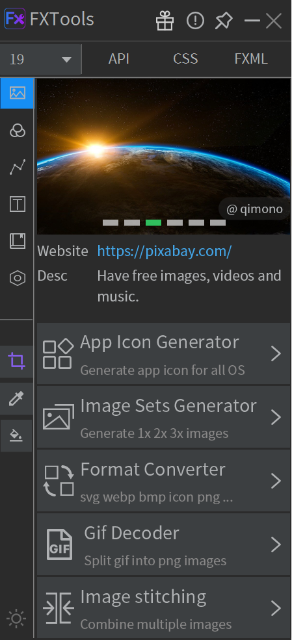
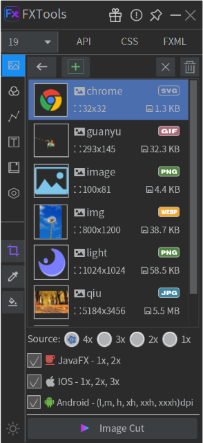
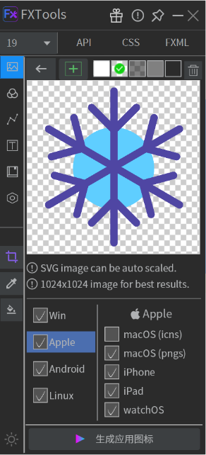
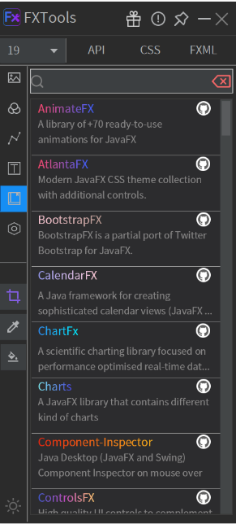
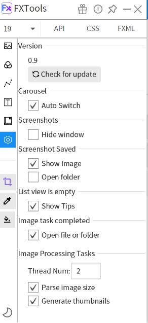
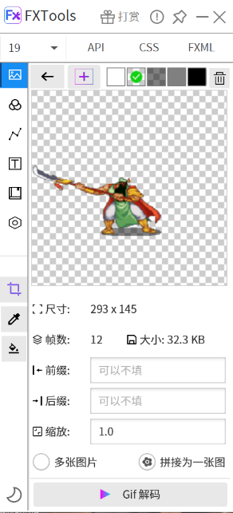
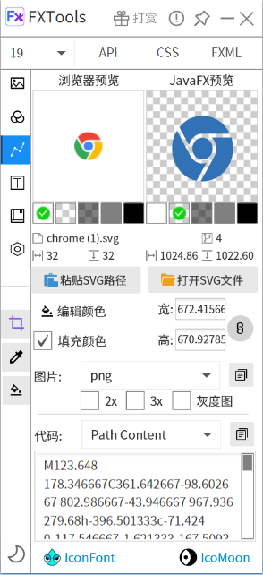
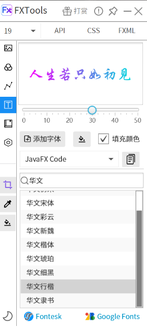

## For: [English](README.md) | 中文 用户.

#### FXTools

一款使用JavaFX开发的工具软件,具有图片处理工具,颜色工具,字体预览工具,Svg工具,等...

**Download**

- [在**Gitee**上下载](https://gitee.com/leewyatt/FXTools/releases)
- [在**Github**上下载](https://github.com/leewyatt/FXTools/releases)

操作与使用预览: https://www.bilibili.com/video/BV173411D7AU

我之前写过[Java FXTools]的IDEA插件，但是IDEA的API会变，我没时间和精力一直维护，也为了方便Netbeans和Eclipse的朋友使用,所以做了这个单机版;重写代码，重新布局，增加新功能；<br>
项目使用java17进行开发,但是在试图兼容java8(除开截图相关API). 所以并没有使用太多语法上的高级特性.<br />
现在使用的JDK是 **Liberica 17** . <br />


<span id="tools-doc" ></span>
使用JavaFX开发的实用小工具，适用于PC端和移动端，主要有如下功能:

#### 软件截图

<span id="screenshots" ></span>









#### 图片工具

<span id="image-tools" ></span>

- [1] 程序图片生成器: 支持Windows、Mac OS、Linux、i Phone、i Pad、watch OS、Android等系统的图标生成;( icon, icns, png...)
- [2] 多倍图切图工具: 支持生成javafx、ios、android等平台多倍图图片；例如。 1x,2x,3x
- [3] 图片的格式转换: 支持常见的图像格式转换；例如: svg, webp, png, bmp, jpg, gif.
- [4] Gif动图解码: 把Gif动图分解成一帧一帧的图片;(主要方便FXGL等游戏引擎使用).
- [5] 图片拼接: 把多张图片拼接成一张图片,提高效率,减少io次数;(主要方便FXGL等游戏引擎使用).
- [6] 截屏;保存屏幕上指定位置的图像；(* java9以上的版本支持高清截屏;java8在高分辨率的情况下截屏偏小;如果要支持java8,那么只需要修改几行有关截图的代码)

#### 颜色工具

<span id="color-tools" ></span>

- [1] 吸取屏幕指定位置的颜色;对屏幕指定区域进行截图; (java8版本在高分辨率屏幕下,截图效果不佳)
- [2] 选择的颜色,可以直接转为(fx)CSS代码或者java code;
- [3] 20+多页的颜色搭配参考;
- [4] 多种颜色格式互相转换 HSB,RGB,HSL,Hex

#### SVG工具

<span id="svg-tools" ></span>

- [1] 支持SVG Path的预览;方便查看svg在fx下的显示效果;
- [2] 方便提取SVG文件里的Path属性,方便在FX里使用;
- [3] 生成Path代码,生成fx css代码或者java代码;

#### 字体工具

<span id="font-tools" ></span>

- [1] 预览系统自带的字体效果;
- [2] 支持添加外部字体.进行预览;
- [3] 生成fx css代码或者java代码;

#### 库和书籍

<span id="library" ></span>

- [1] 参考[AwesomeJavaFX](https://github.com/mhrimaz/AwesomeJavaFX)列举了很多很棒的开源库,书籍等

#### Tips

<span id="tips" ></span>

- [1] 图片处理时,支持多线程;在设置页面可以设置线程数量;默认是2线程;
- [2] 在设置页面关闭图片预览和解析图片大小,可以加快图片加载速度;
- [3] 关闭加载图片时解析图像大小和生成缩略图,可以加快处理图片的速度;
- [4] 图片处理完成默认会打开图片的输出目录;
- [5] 软件支持 深色模式 与 浅色模式;

#### 感谢
<span id="thanks" ></span>

|                                                                                                                                                                                                                                                                                                   |
|---------------------------------------------------------------------------------------------------------------------------------------------------------------------------------------------------------------------------------------------------------------------------------------------------|
|  Thanks to [ej-technologies](https://www.ej-technologies.com/) for their [open source license](https://www.ej-technologies.com/buy/install4j/openSource). We use Install4j to build installers. |
| Thanks to [Gluon](https://gluonhq.com/) for documents.                                                                                                                                                     |
| Thanks to [SceneBuilder](https://github.com/gluonhq/scenebuilder) Used ColorPicker, DoubleTextField etc.                                                                                             |
| Thanks to [controlsfx](https://github.com/controlsfx/controlsfx)                                                                                                                                                        |
| Thanks to [@Abhinay Agarwal](https://github.com/abhinayagarwal)for help.                                                                                                                                                                                                                          |
| Thanks to [@黑羽](https://blog.thetbw.xyz/) for providing the storage.                                                                                                                                                                                                                             |
| Thanks to [@Anivie](https://github.com/Anivie) for testing, documentation, etc.;                                                                                                                                                                                                                  |
| Thanks to [openjfx](https://openjfx.io/) for documents, sample project, maven plugin, etc .                                                                                                                                                                                                       |
| Thanks to [AwesomeJavaFX](https://github.com/mhrimaz/AwesomeJavaFX)                                                                                                                                                                                                                               |                                                                                                                                                                                                     |
| Thanks to [guava](https://github.com/google/guava)                                                                                                                                                                                                                                                |
| Thanks to [gson](https://github.com/google/gson)                                                                                                                                                                                                                                                  |
| Thanks to [webp-imageio](https://github.com/sejda-pdf/webp-imageio) for image processing.                                                                                                                                                                                                         |
| Thanks to [thumbnailator](https://github.com/coobird/thumbnailator) for image processing.                                                                                                                                                                                                         |
| Thanks to [image4j](https://github.com/imcdonagh/image4j) for image processing.                                                                                                                                                                                                                   |
| Thanks to [Apache Commons Imaging](https://github.com/apache/commons-imaging) for image processing.                                                                                                                                                                                               |
| Thanks to [batik](https://github.com/apache/xmlgraphics-batik) for svg processing.                                                                                                                                                                                                                |
| Thanks to [animated-gif-lib](https://github.com/rtyley/animated-gif-lib-for-java) for image processing.                                                                                                                                                                                           |
| Thanks to [TwelveMonkeys](https://github.com/haraldk/TwelveMonkeys) for image processing.                                                                                                                                                                                                         |
| Thanks to [ICNS](https://github.com/gino0631/icns) for image processing.                                                                                                                                                                                                                          |
| Thanks to [web_color](https://gitee.com/song-xiansen/web_color)for color matching.                                                                                                                                                                                                                |
| Thanks to various references on the internet.                                                                                                                                                                                                                                                     |
<br />

#### 打赏或者贡献

<span id="donate" ></span>

您可以通过下面的方法来贡献和支持该项目：
* 在 GitHub/Gitee 上为项目加注星标
* 给予反馈
* 提交PR
* 贡献您的想法建议
* 与您的朋友同事分享 FXTools
* 如果您喜欢 FXTools，请考虑捐赠: <br />
  <a href="https://www.buymeacoffee.com/fxtools" target="_blank"></a> <br />
   <br />
   <br />

**注意:** 使用支付宝/微信打赏后，请按照以下格式通过留言或电子邮件提供您的昵称和网址：

`姓名/昵称 [<网站>][: 消息]` (网站和消息是可选的。)

例子: `LeeWyatt <github.com/leewyatt>: 我喜欢用FXTools!`

如果您选择发送电子邮件，请同时提供以下信息:
  ```text
  打赏金额: <金额>
  支付平台: 支付宝/微信支付
  付款号码 (最后 5 位数字): <编号>
  ```
电子邮件: [leewyatt@foxmail.com][mailto] (点击发送邮件)

您提供的姓名/昵称、网站和捐款总额将被添加到 [捐赠列表] <br />

  **感谢您的支持!**

#### 打赏列表

<span id="donors"></span>
 
| **Name**   | **Website**                                                                             | **Message**              | **Amount** |
|------------|-----------------------------------------------------------------------------------------|--------------------------|------------|
| 色彩通旗舰店     | [天猫旗舰店](https://secaitong.tmall.com/shop/view_shop.htm?spm=a230r.1.14.10.65396cf7wJJng) | 色卡选购! 打造中国色彩标准为您提供色彩解决方案 | 288.00 CNY |
| CierConnor |                                                                                         | 真不错                      | 200 CNY    |
| 忆清风        |                                                                                         | 很实用，加油！                  | 188.88 CNY |
| Mnefo      |             |                          | 50 CNY     |
| 诚信         |             |                          | 30 CNY     |
| gio        |                                                                                         |                          | 8 CNY      |
| 守望者        |                                                                                         |                          | 6.66 CNY   |
| Andy97     |                                                                                         |                          | 6.66 CNY   |
| 随风Kiki     |                                                                                         | 喝杯可乐                     | 3 CNY      |
| (匿名)       |                                                                                         | 6666                     | 0.01 CNY   |

